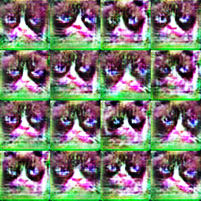
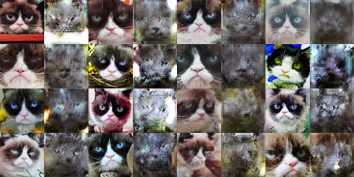

# 16726_p3

## DC GAN Experiments

### Discriminator Padding
> Padding: In each of the convolutional layers shown above, we downsample the spatial dimension of the input volume by a factor of 2. Given that we use kernel size K = 4 and stride S = 2, what should the padding be? Write your answer on your website, and show your work (e.g., the formula you used to derive the padding).

<!-- write the conv formula -->
```
Out = (In - Kernel + 2 * Pad) / Stride + 1
```
Since we have `Out = In/2, K=4, S=2`, we can solve for `Pad`:
```
In / 2 = (In - 4 + 2 * Pad) / 2 + 1
In = In - 4 + 2 * Pad + 2
Pad = 1
```

### DiffAugment vs Regular Augmentation
We produce late samples from DiffAugment only vs Deluxe Augment only.

"Deluxe" Aug



DiffAug


The samples are quite different; notably the standard deluxe augmentation has heavy colorization artifacts (despite my including color jitter augmentation). Also, there may be slightly more diversity in the DiffAug samples. Implementation wise this is likely because DiffAug also applies to generator samples, whereas standard augmentation only applies to real samples. Standard augmentation cripples the discriminator with respect to the augmented feature, and the generator no longer has incentive to choose the realistic setting of the augmented feature (hence color distortion). (Though note, not all samples have this distortion; some look reasonable still) DiffAug still has this effect on the discriminator, but also allows the generator to learn realistic settings of the augmented feature (since it's differentiable).

### Training Curves
Plots are taken from wandb. Curves are annotated.

Discriminator


Generator losses


Comments:
Due to the DCGAN objective formulation, we know discriminator scores are at chance around `0.25=(0.5 - 1)^2`.  In a balanced training, I would expect discriminator curves to oscillate below chance(since it generally has an easier job, especially in toy experiments such as this hw); improved regularization should increase discriminator loss towards this. Indeed we see the intuitive hierarchy of discriminator losses: vanilla DCGAN as lowest, both forms of regularization as higher, and combined regularization as highest. Conversely, the generators are high to low in that order. There is some decrease in losses on both ends, but overall the discriminator dominates. I think a qualitatively better curve would have discriminator loss eventually trending upward, but alas...

### Deluxe + DiffAugment Samples

Early (Iteration 200)


Late (Iteration 6400)


Comments:
Early iterations are plain noisy -- the only feature captured is gross color distributions; edges are blurry and actual pixels are also contaminated with color jitter noise. Later iterations are much better - having all primary cat features including fine fine details like pupils and whiskers, but still far from realistic (as would be predicted by loss curves). There is also not much sample diversity.

### DCGAN Misc
For completeness we also show the vanilla, unaugmented samples (others shown in previous section).


## CycleGAN

Note I apply DiffAug by default based on results in previous seciton; also pilot without looked highly colorized. Based on tuning, it seemed like batch norm worked better than instance norm, `init_zero_weights` should be set to true, and `cycle_lambda=3` worked better than 1 or 10. It should be noted I discovered a bug _after_ all this tuning in the patch discriminator, which made a drastic difference; the previous tuning may not have been necessary.

### Initial 1K iteration tests
TODO
No cycle consistency


With cycle consistency



### 10K iteration tests
We run this comparison with and without cycle consistency loss, and with and without patch discriminator.
### Grumpy Cat
Full             |  -Cycle Consistency | -Patch Discriminator
:---:|:---:|:---:
  |   | 

TODO discussion

### Apple2Orange

Full             |  -Cycle Consistency | -Patch Discriminator
:---:|:---:|:---:
  |   | 

TODO discussion